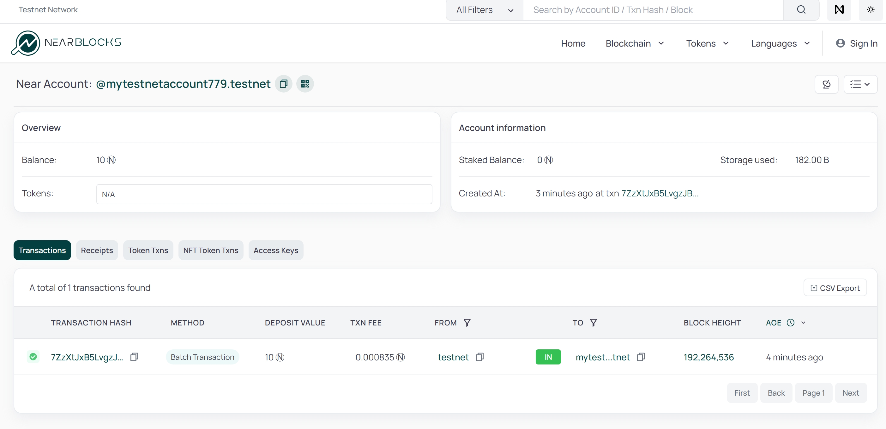
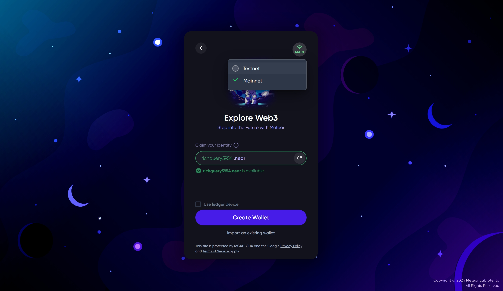
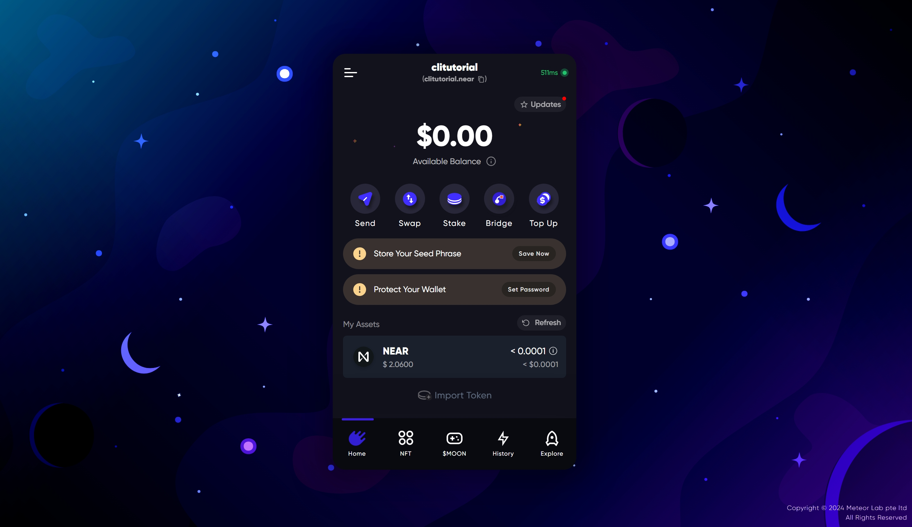
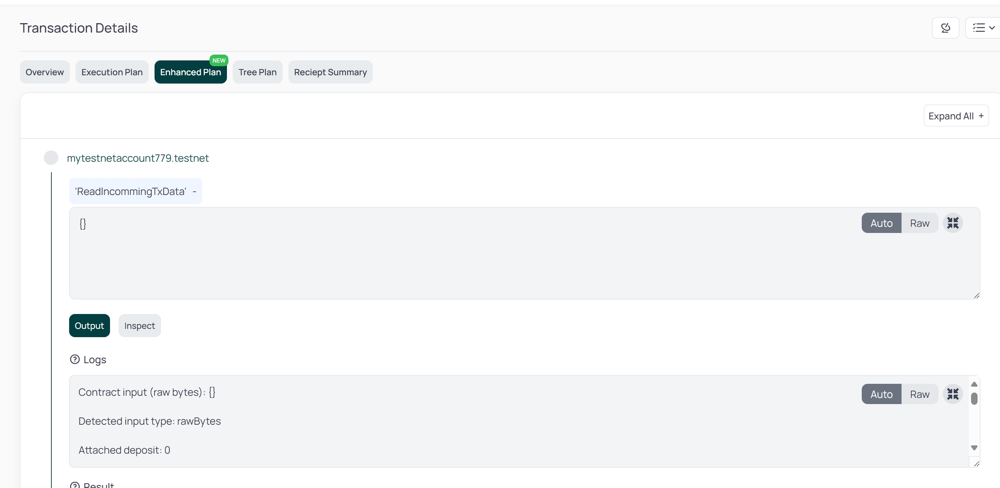
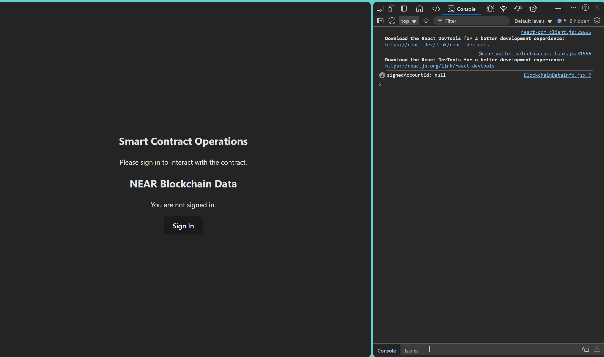
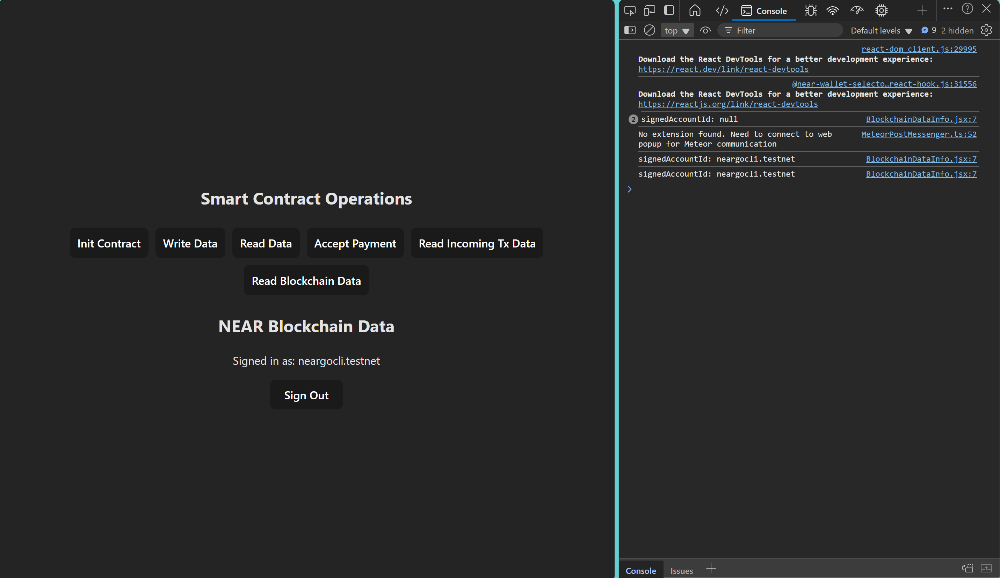
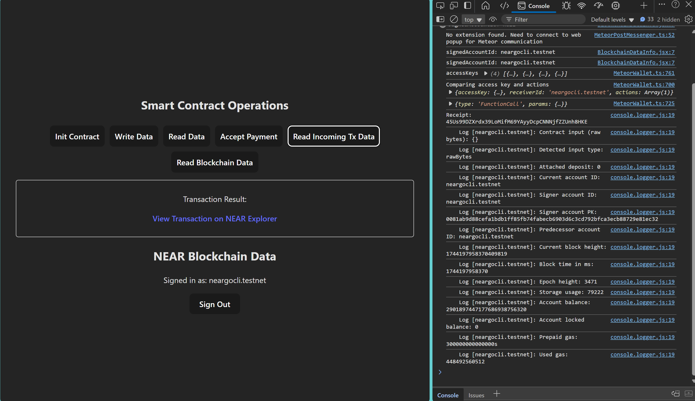

# 🚀 Full Stack NEAR Project with Go

This tutorial guides you through setting up a full-stack NEAR project with **Go**, **React**, **Node.js**, and NEAR smart contracts.

---

## 1. Create the Project

Run this command to generate the full-stack project template:

```bash
near-go create -p "full_stack_template" \
  -m "github.com/vlmoon99/near-sdk-go/full_stack_template" \
  -t "full-stack-react-nodejs"
```

Navigate into the project folder:

```bash
cd full_stack_template
```

### Project Structure:

```bash
(base) user@pc1:~/dev/near-sdk-go/examples/full_stack_template$ ls
backend  client  contract  contract_listener
```

### Folder Overview:
- **backend/**  
  A backend server (Node.js) to:
  - Perform blockchain operations like transfers and balance checks.
  - Interact with smart contracts.
  - Manage database storage.

- **client/**  
  A React + Vite frontend to call smart contract functions directly from the browser.

- **contract/**  
  The smart contract written in **Rust** or **Go**. Deploy it on the NEAR testnet or mainnet.

- **contract_listener/**  
  A listener for smart contract events using the NEAR Lake framework.  
  ⚠️ _Note: Requires an AWS account with EC2 access._

---

## 2. Set Up Accounts for Deployment

### 🧪 Testnet Account Setup

1. **Create a Testnet Account:**  
   Testnet accounts must end with `.testnet`.  
   Check availability on [NEAR Blocks Testnet](https://testnet.nearblocks.io/address/mytestnetaccount779.testnet).

   ```bash
   near-go account create -n "testnet" -a "mytestnetaccount779.testnet"
   ```



---

### 🌐 Mainnet Account Setup

1. **Create a Mainnet Account:**  
   Use any NEAR wallet, like:
   - [NEAR Wallet](https://wallet.near.org/)  
   - [Meteor Wallet](https://wallet.meteorwallet.app/add_wallet/create_new)

  


2. **Import Mainnet Wallet into the CLI:**  
   Run the import function:

   ```bash
   near-go account import
   ```

   Follow the prompts to choose the import method:
   - Using **web wallet** for NEAR sign-in.
   - Using a **seed phrase**. Detailed instructions can be found [here](https://github.com/near/near-cli-rs/blob/main/docs/GUIDE.en.md#using-seed-phrase---import-existing-account-using-a-seed-phrase).

```bash
? How would you like to import the account?  
  using-web-wallet          - Import with NEAR Wallet  
> using-seed-phrase         - Import with a seed phrase  
  using-private-key         - Import with a private key  
  back
```

---

## 3. Deploy on Testnet and Mainnet

### Build the Project

```bash
near-go build
```

### Deploy to Testnet

```bash
near-go deploy -id "mytestnetaccount779.testnet" -n "testnet"
```

To call a contract function:

```bash
near contract call-function as-transaction mytestnetaccount779.testnet ReadIncommingTxData \
  json-args {} prepaid-gas '100.0 Tgas' attached-deposit '0 NEAR' \
  sign-as mytestnetaccount779.testnet network-config testnet \
  sign-with-legacy-keychain send
```

_See the result on [NEAR Blocks Testnet](https://testnet.nearblocks.io/txns/BTgrqPc3e2G1dB1gXCDHic2g8UGBSTJc6nxZPStXih1P?tab=enhanced)._  


### Deploy to Mainnet

```bash
near-go deploy -id "clitutorial.near" -n "mainnet"
```

To test the contract:

```bash
near contract call-function as-transaction clitutorial.near ReadIncommingTxData \
  json-args {} prepaid-gas '100.0 Tgas' attached-deposit '0 NEAR' \
  sign-as clitutorial.near network-config mainnet \
  sign-with-legacy-keychain send
```

## 4. Connect Client, Backend, and Contract Listener to the Smart Contract

### 📲 Client

Start the client app:

```bash
cd client && yarn dev
```

Open your browser and access `localhost`. In the dev console:

1. **Login**  
   

2. **After Login:** View Home page with smart contract functions  
   

3. **Call ReadIncommingTxData** to view TX logs  
   

### 🚀 Backend

Start the backend:

```bash
cd backend && yarn ts-node src/index.ts
```

Sample API calls:

**InitContract:**
```bash
curl -X POST http://localhost:3000/near/contract/InitContract \
  -H "Content-Type: application/json" \
  -d '{"args": {}, "deposit": "0"}'
```

**WriteData:**
```bash
curl -X POST http://localhost:3000/near/contract/WriteData \
  -H "Content-Type: application/json" \
  -d '{"args": {"key": "testKey", "data": "lalalla"}, "deposit": "1"}'
```

**ReadData:**
```bash
curl -X POST http://localhost:3000/near/contract/ReadData \
  -H "Content-Type: application/json" \
  -d '{"args": {"key": "testKey"}, "deposit": "0"}'
```

**ReadIncommingTxData:**
```bash
curl -X POST http://localhost:3000/near/contract/ReadIncommingTxData \
  -H "Content-Type: application/json" \
  -d '{"args": {}, "deposit": "0"}'
```

Each response returns a transaction hash viewable on NEAR Blocks.

### 🧰 Contract Listener

Start the listener:

```bash
cd contract_listener && yarn ts-node src/index.ts
```

Use NEAR CLI to trigger events:

```bash
near-go deploy -id "mytestnetaccount779.testnet" -n "testnet"
```

```bash
near contract call-function as-transaction mytestnetaccount779.testnet ReadIncommingTxData \
  json-args {} prepaid-gas '100.0 Tgas' attached-deposit '0 NEAR' \
  sign-as mytestnetaccount779.testnet network-config testnet \
  sign-with-legacy-keychain send
```

### Sample Output

#### ✅ **Filtered Actions by ID (1)** – *Deploy Contract*
```json
{
  "receiptId": "BjBLFkZa3LnapWvSwEKrrK5qKLbZgh89b8GPDt75A1bU",
  "receiptStatus": { "SuccessValue": "" },
  "operations": [ { "DeployContract": { "code": "..." } } ]
}
```

#### 📢 **Events**
```json
[
  {
    "receiptId": "37vXKsZum7uew4BiGpxhvotLo7EVU13qokQ8hcYSmhcV",
    "rawEvent": {
      "event": "ReadIncommingTxData",
      "standard": "nep999",
      "version": "1.0.0",
      "data": [
        { "info": "ReadIncommingTxData", "test": ["test11"] }
      ]
    }
  }
]
```

#### ✅ **Filtered Actions by ID (2)** – *FunctionCall: `ReadIncommingTxData`*
```json
{
  "receiptId": "37vXKsZum7uew4BiGpxhvotLo7EVU13qokQ8hcYSmhcV",
  "receiptStatus": { "SuccessValue": "UmVhZEluY29tbWluZ1R4RGF0YQ==" },
  "operations": [
    {
      "FunctionCall": {
        "methodName": "ReadIncommingTxData",
        "args": "{}",
        "deposit": "0",
        "gas": 100000000000000
      }
    }
  ]
}
```

#### ✅ **Filtered Actions by ID (3)** – *Transfer*
```json
{
  "receiptId": "79Vku7AMti9nujM4Hodr7RKopvf3JA1ADHN8FTL485zR",
  "operations": [
    {
      "Transfer": {
        "deposit": "18078627381676689526136"
      }
    }
  ]
}
```


5.Manage in the production

- Transactions (How to see tx, indexer)

- Account System (account names,creation,storage)

- Key's Managment


